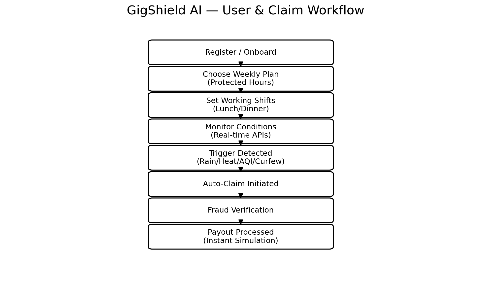
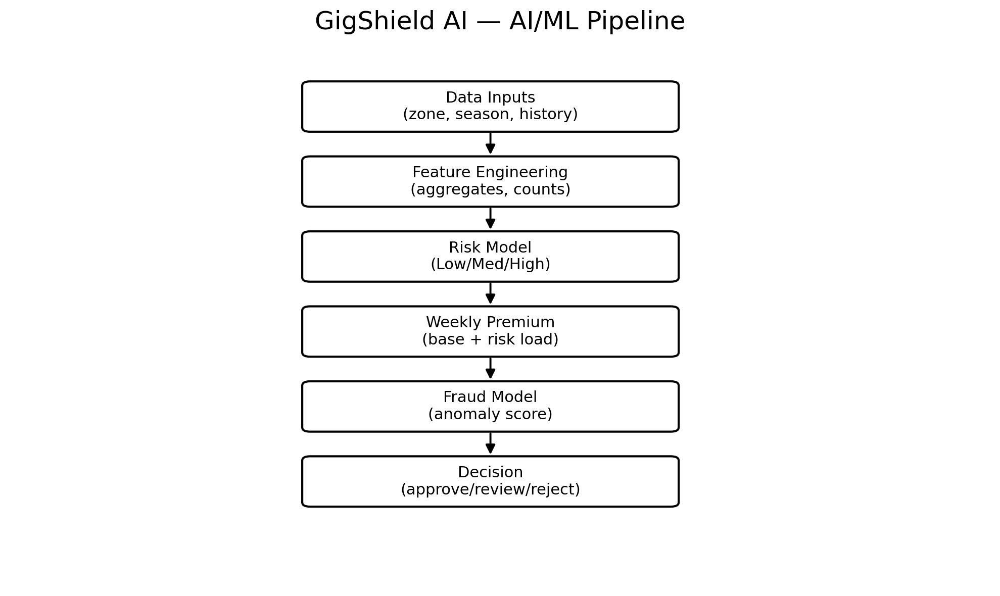
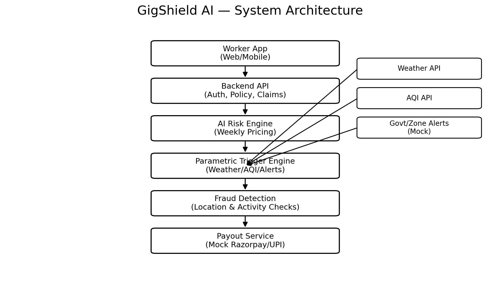

# GigShield AI

AI-powered shift-based income protection platform for food delivery partners affected by environmental disruptions.

---

## 1. Problem Statement

Food delivery partners (Swiggy/Zomato) earn day-to-day based on active delivery hours. External disruptions such as heavy rain, extreme heat, severe pollution, and sudden zone shutdowns can reduce deliveries or make it unsafe to work, causing immediate income loss.

Traditional insurance does not cover short-term wage loss from these uncontrollable events. GigShield AI solves this by providing **AI-powered parametric income protection** that automatically triggers compensation when predefined disruption conditions occur in the worker’s operating zone.

**Coverage scope (critical):** Income loss only. No health, life, accident, or vehicle repair coverage.  
**Pricing (critical):** Weekly premium model aligned to gig workers’ weekly earnings cycle.

---

## 2. Worker Persona

**Name:**  Kumar swami 
**Age:** 24 
**Occupation:** Swiggy Delivery Partner  
**City:** Guntur 

Kumar works around **8 hours per day** delivering food orders. On average he earns about **₹500–₹700 daily**, depending on demand and delivery volume.

During disruptions such as **heavy rainfall, extreme heat, severe pollution, or sudden zone shutdowns**, the number of delivery orders drops significantly. Sometimes delivery platforms temporarily stop operations in certain areas due to safety reasons.

As a result, kumar may lose **3–5 working hours** in a day, which directly reduces his daily income.

GigShield AI helps workers like kumar by providing **weekly income protection**. When environmental disruptions occur during their working shifts, the platform automatically compensates them for lost working hours.

---

## 3. Our Solution

**GigShield AI is an AI-powered parametric income protection platform** designed to safeguard food delivery partners from income loss caused by external disruptions such as extreme weather, pollution, and zone shutdowns.

Unlike traditional insurance systems that require manual claim submissions, GigShield AI uses **parametric triggers based on objective environmental data**. The platform continuously monitors external data sources such as weather APIs, air-quality data, and government alerts to **detect disruption events in real time**.

Delivery partners subscribe to a **simple weekly protection plan** and define their **usual working shifts** (for example lunch and dinner shifts). The system tracks environmental conditions in the worker’s operating zone during those scheduled shifts.

When **predefined disruption thresholds** are detected such as heavy rainfall, extreme heat, hazardous pollution levels, or zone closures the system **automatically initiates a claim** and calculates the **income loss based on the worker’s protected hours and average earnings**.

This automated parametric workflow ensures fast, transparent, and fair payouts without requiring workers to file claims manually, helping gig workers maintain financial stability during unexpected disruptions.

---

## 4. Unique Features

Most parametric insurance prototypes pay everyone in a city/zone when it rains. GigShield AI improves fairness and reduces fraud using **shift-based coverage**:

1. **Shift-Based Coverage (Fair Payouts)**
   - Workers define their typical working shifts (e.g., Lunch 12–3, Dinner 7–10).
   - Payouts trigger **only if a disruption happens during the worker’s scheduled shift**.

2. **Protected-Hours Weekly Plans (Gig-Friendly)**
   - Plans are defined by “protected hours per week” (not complex insurance terms).
   - This matches how delivery partners think about income loss: *lost working hours*.

3. **Hyperlocal Risk Pricing (AI-Powered)**
   - Weekly premium adjusts based on zone risk (flood-prone, high AQI, frequent storms).

4. **Zero-Touch Claims**
   - No claim form. When trigger conditions are met, the system initiates claims automatically.

5. **Built-In Fraud Checks**
   - Location consistency checks (anti GPS-spoof logic).
   - Duplicate claim prevention for the same event window.

6. **Digital Infrastructure Risk Coverage (Platform Outage Protection)**
   - GigShield AI extends parametric insurance beyond environmental risks to include platform-level disruptions.
   - If the delivery platform experiences app crashes, server downtime, or order assignment failures, workers are unable to earn despite being active.
   - The system detects such conditions using order assignment data and worker activity logs and triggers compensation automatically.

---

## 5. Parametric Disruption Triggers

GigShield AI uses parametric triggers to automatically detect environmental disruptions that affect delivery workers. When predefined conditions are met, the system automatically initiates compensation without requiring manual claims.

| Disruption Type | Trigger Condition | Impact on Delivery Workers |
|-----------------|------------------|-----------------------------|
| Heavy Rain | Rainfall > 30 mm/hour | Deliveries slow down or pause |
| Extreme Heat | Temperature > 40°C | Unsafe outdoor working conditions |
| Severe Pollution | AQI > 300 | Outdoor work becomes risky |
| Zone Shutdown / Curfew | Government alert or platform zone closure | Deliveries temporarily halted |
|Platform Outage / App Failure | Worker online but receives 0 orders for > 60 minutes due to system failure | Worker cannot receive orders and loses active earning time |

The platform continuously monitors environmental APIs and platform activity data. If a disruption occurs in a worker’s delivery zone during their scheduled working shift, the system automatically detects the event and initiates compensation.

In addition to environmental disruptions, GigShield AI also accounts for **digital infrastructure failures such as platform outages**. If a delivery partner is online and active but does not receive any orders for a sustained period due to **backend** or **server issues**, the system treats it as a valid disruption event.

The system verifies worker activity using the GigShield app (such as active shift status and location data) along with available platform signals. Once validated, the system calculates the lost working hours and automatically triggers compensation based on the worker’s protected hours and average earnings.

---

## 6. Weekly Premium Model

GigShield AI offers simple weekly subscription plans designed for gig workers. Instead of complex insurance policies, workers select plans based on the number of **protected working hours per week**.

| Plan | Weekly Premium | Protected Hours | Maximum Weekly Payout |
|------|---------------|-----------------|----------------------|
| Basic | ₹15 | 2 hours | ₹300 |
| Standard | ₹25 | 4 hours | ₹600 |
| Premium | ₹35 | 6 hours | ₹1000 |

The payout is calculated based on the worker’s **average hourly earnings**.

Example:

If a worker earns ₹120 per hour and a disruption affects 3 hours of scheduled work:

Calculated Payout = ₹120 × 3 = ₹360

If the worker is on the Basic Plan (Maximum Weekly Payout: ₹300):

Final Payout = ₹300 (capped by plan limit)

Premiums may also be dynamically adjusted using AI risk models based on environmental conditions and historical disruption data in specific zones.

---

## 7. System Workflow

GigShield AI follows a fully automated workflow to ensure fast and transparent income protection for delivery partners.

1. **Worker Registration**
   - Delivery partner registers on the platform and provides basic details.

2. **Select Weekly Protection Plan**
   - Worker chooses a weekly insurance plan based on protected hours.

3. **Define Working Shifts**
   - Worker defines usual delivery shifts (e.g., lunch shift 12–3 PM, dinner shift 7–10 PM).

4. **Continuous Environmental Monitoring**
   - The system continuously monitors weather, pollution, government alerts and platform activity using external APIs.

5. **Trigger Detection**
   - If a disruption condition (rain, extreme heat, pollution, curfew) occurs in the worker’s zone during their scheduled shift, the trigger activates.

6. **Fraud Detection & Verification**
   - AI verifies worker location and activity to prevent fraudulent claims.

7. **Automatic Claim Approval**
   - Once validated, the system automatically calculates the lost income.

8. **Instant Payout**
   - Compensation is processed instantly through the payment system.
  

---

## 8. AI / ML Integration

GigShield AI integrates AI/ML across pricing, fraud detection, and predictive insights.

### A) AI-Powered Risk Pricing (Weekly Premium Adjustment)
Goal: price weekly plans fairly by zone risk.

**Inputs (features):**
- Worker operating zone (pincode/geohash)
- Historical disruption frequency (rain/heat/AQI)
- Season/month
- Past claims frequency in the zone

**Output:**
- Zone Risk Score (Low / Medium / High)
- Premium adjustment per week (e.g., +₹0 to +₹10)

### B) Intelligent Fraud Detection (Claim Verification)
Goal: detect suspicious claim behavior automatically.

**Fraud signals:**
- Location inconsistency during claimed disruption window (anti GPS spoof checks)
- Worker not in-zone during scheduled shift
- Duplicate claims for same event window
- Abnormally frequent claims compared to peers in the same zone

**Output:**
- Fraud Score and decision: Approve / Manual Review / Reject (prototype will simulate this)

### C) Predictive Risk Alerts (Worker Notifications)
Goal: warn workers about likely disruptions in upcoming shifts.

**Example:**
If the model predicts high probability of heavy rain during dinner shift tomorrow, the app notifies the worker to plan accordingly.

---

## 8.1 ML Models Used in GigShield AI

GigShield AI uses a combination of machine learning models to support dynamic pricing, fraud detection, and predictive alerts.

### 1. Random Forest Model — Risk Pricing
We use a **Random Forest model** to estimate the disruption risk level of a delivery zone based on factors such as:
- historical rainfall frequency
- temperature patterns
- AQI history
- seasonal trends
- claim frequency in the zone

**Why this model?**  
Random Forest handles non-linear relationships well and works effectively with mixed environmental and operational features. It is also robust and easy to interpret for risk classification.

**Purpose in our system:**  
- classify zones into low, medium, or high risk
- support dynamic weekly premium calculation

---

### 2. Isolation Forest — Fraud Detection
We use **Isolation Forest** for anomaly detection in claims.

**Input signals include:**
- worker location consistency
- shift activity validation
- repeated claims in short time periods
- duplicate event claims
- unusual claim frequency compared to similar workers

**Why this model?**  
Isolation Forest is well-suited for detecting rare and unusual behavior patterns, which makes it effective for identifying potentially fraudulent claims.

**Purpose in our system:**  
- generate a fraud risk score
- flag suspicious claims for review
- reduce false or manipulated payouts

---

### 3. Logistic Regression — Predictive Risk Alerts
We use **Logistic Regression** to predict the probability of a disruption occurring during an upcoming worker shift.

**Input features include:**
- weather forecast
- AQI forecast
- zone history
- time of day
- seasonal conditions

**Why this model?**  
Logistic Regression is simple, fast, and explainable, making it suitable for early-stage risk prediction in a hackathon prototype.

**Purpose in our system:**  
- predict high-risk delivery shifts
- notify workers in advance about likely disruption events
- improve worker planning and preparedness

---

## 9. Technology Stack

GigShield AI is built using a modern and scalable technology stack.

### Frontend
- React.js
- Tailwind CSS

### Backend
- Python FastAPI
- REST API architecture

### Database
- PostgreSQL

### AI / ML
- Python
- Scikit-learn

### External APIs
- Weather API (for rainfall and temperature data)
- AQI API (for pollution levels)

### Payment Integration
- Razorpay (test mode) for payout simulation

---

## 10. System Architecture

GigShield AI follows a modular architecture that integrates user applications, backend services, AI models, and external data sources.

### Architecture Components

1. **Worker Application (Frontend)**
   - Allows delivery partners to register, select weekly protection plans, and track coverage.

2. **Backend Server**
   - Handles user management, insurance policy management, and system logic.

3. **AI Risk Engine**
   - Calculates zone-based risk scores and dynamically adjusts weekly premiums.

4. **Parametric Trigger Engine**
   - Continuously monitors external environmental APIs and detects disruption events.

5. **Fraud Detection Module**
   - Verifies worker location and activity to prevent fraudulent claims.

6. **Payment Processing System**
   - Simulates automated payouts through payment gateway integration.

### Architecture Flow

Worker App → Backend Server → AI Risk Engine → Trigger Detection → Fraud Check → Automatic Payout

---

## 11. Development Plan

The development of GigShield AI will be completed in three phases aligned with the DEVTrails competition timeline.

### Phase 1 — Ideation & Foundation
- Define worker persona and problem statement
- Design system architecture
- Define parametric triggers and weekly pricing model
- Plan AI integration strategy
- Create GitHub repository and project structure

### Phase 2 — Automation & Protection
- Implement worker registration and onboarding
- Develop insurance policy management system
- Integrate environmental APIs for disruption detection
- Implement automated parametric claim triggers
- Build basic AI risk pricing model

### Phase 3 — Scale & Optimization
- Implement advanced fraud detection system
- Integrate instant payout simulation using payment gateway
- Develop analytics dashboard for workers and administrators
- Improve AI prediction models for disruption forecasting
- Prepare final demo and pitch presentation
- 

### 12. Adversarial Defense & Anti-Spoofing Strategy

GigShield AI addresses large-scale GPS spoofing attacks by introducing a **multi-layered verification system** that validates not just location, but actual earning activity and behavioral patterns of delivery partners.

Instead of relying solely on GPS data, the system ensures that compensation is provided only when **real income loss occurs during active working shifts.**

### 1. Differentiation: Genuine Worker vs Spoofed User

GigShield AI differentiates real workers from fraudulent users using a combination of **activity validation, delivery impact analysis, and movement consistency.**

A claim is considered valid only if:

Disruption Detected
+ Worker Active During Shift
+ Verified Drop in Delivery Activity
→ Compensation Triggered

A claim is considered suspicious if:

Disruption Detected
+ No Delivery Activity
+ No Reduction in Orders
→ Claim Flagged

This ensures that users who are merely “online” without actual work engagement are not eligible for payouts.

### 2. Data Signals Used Beyond GPS

To detect fraud and coordinated spoofing attacks, GigShield AI analyzes multiple real-time data points:

**Worker Activity Signals**

+ App online status during shift

+ Order acceptance / rejection behavior*

+ Active session duration

**Delivery Performance Signals**

*Orders received per hour

*Deliveries completed per hour

*Drop in delivery volume compared to historical average

**Movement & Device Signals**

*Continuous location tracking (no sudden jumps)

*Realistic movement speed

*Route consistency during shift

**Zone-Level Signals**

*Total orders in the zone

*Number of active delivery partners

*Sudden spike in claims without corresponding drop in orders

### 3. Delivery Impact Validation Logic

GigShield AI verifies that disruption has actually impacted earning capacity.

**Delivery Drop % = (Average Orders − Current Orders) / Average Orders
If Delivery Drop > 40% → Valid Income Impact  
Else → No Significant Impact**

This prevents payouts in cases where environmental disruption exists but delivery demand remains stable or increases.

### 4. Fraud Scoring Mechanism

Each claim is evaluated using a simple fraud scoring logic:

**+1 → Worker active during shift  
+1 → Verified delivery drop  
+1 → Valid movement pattern**

**Score = 3 → Approved  
Score = 2 → Partial payout / verification  
Score ≤1 → Rejected**

### 5. Coordinated Fraud Ring Detection

GigShield AI detects group-level fraud patterns by analyzing cluster behavior:

*Multiple users claiming from same zone at same time

*No corresponding drop in delivery demand

*Similar activity patterns across users

**Cluster anomaly detected → Claims temporarily held for verificatio**

This prevents mass payout exploitation through coordinated spoofing attacks.

### 6. UX Balance: Protecting Genuine Workers

To ensure fairness and avoid penalizing honest workers:

Claims are not **immediately rejected**

Medium-risk claims are **processed with partial payout**

Final verification is performed asynchronously

Example:

**Low confidence claim → 50% payout released instantly  
Remaining amount → processed after verification**

This ensures that workers facing genuine disruptions (e.g., network failure during heavy rain) are not unfairly denied compensation.

### 7. Real-Time Risk Scoring & Pre-Payout Validation

GigShield AI ensures that all claims are evaluated in real-time before any payout is processed.

**Disruption Detected
→ Multi-layer validation (activity + delivery + movement)
→ Fraud Risk Score Calculation
→ Payout Decision**

Each claim is assigned a real-time risk score based on:

*worker activity

*delivery impact

*movement consistency

*zone-level behavior

Decision logic:

*Low Risk → Instant payout

*Medium Risk → Partial payout with verification

*High Risk → Claim blocked

This pre-payout validation layer prevents fraudulent claims from being processed, ensuring that the system is resilient against large-scale coordinated spoofing attacks.

### 8. AI-Based Anomaly Detection 

GigShield AI enhances fraud detection using anomaly detection models such as Isolation Forest.

These models analyze:

abnormal claim frequency

deviation in delivery patterns

unusual worker behavior compared to historical data

**Significant deviation from normal patterns → flagged as anomaly**

This allows the system to detect sophisticated fraud attempts even when individual signals appear normal.

  
